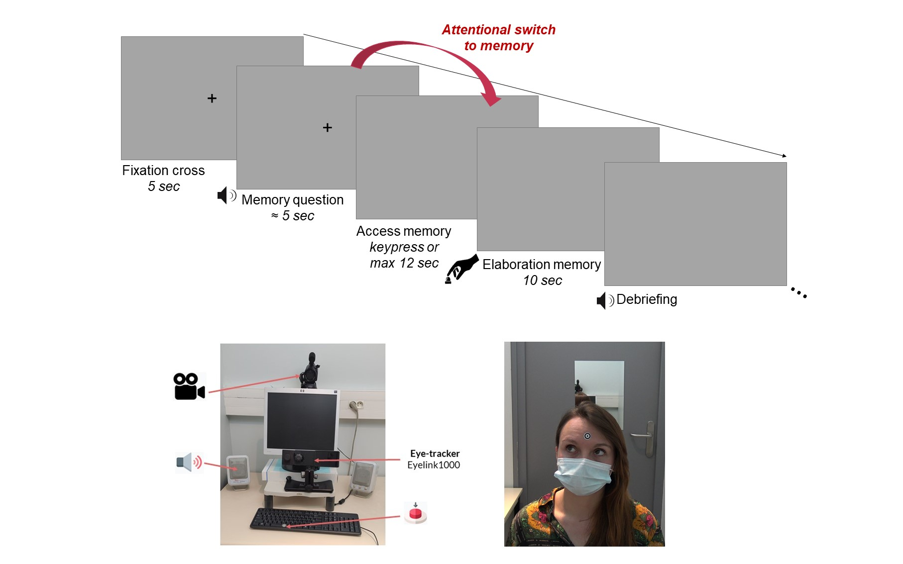

# Gaze aversion during autobiographical memory retrieval


This repository contains code to reproduce analyses from the paper *Why do you look away while trying to remember your last birthday party? Gaze aversion as a marker of the attentional switch to autobiographical memory*.

## Data
The raw data and preprocessed data for 32 participants (behavioural and eye-tracking data) are available at [OSF](https://osf.io/pbvmq/).

The material to reproduce the experiment is available at [OSF_task](https://osf.io/6w5yq/download).
Here is an illustration of the experimental set_up:
<!--  -->
<p align='center'></p>


## Usage
To setup the code please follow the following steps : 
1) Run the following code in the terminal
```
mkdir GazeAversionAStoM 
cd GazeAversionAStoM

conda create --name gaze_astom python==3.8 #alternatively you can also use venvs
conda activate gaze_astom
git clone https://github.com/bhavinc/dummy-gaze-aversion.git

cd dummy-gaze-aversion
cd code
pip install -r requirements.txt 
```
2) Download the data folder from [OSF_data](https://osf.io/9h3xa/download), copy and unzip the data folder insise the code folder (which has been created during the step 1).
3) Run the .ipynb files in the order indicated by the number at the beginning of the file name (example: 1_extraction_gaze_aversion_1.ipynb before 2_extraction_gaze_aversion_2_access.ipynb, and so on).
